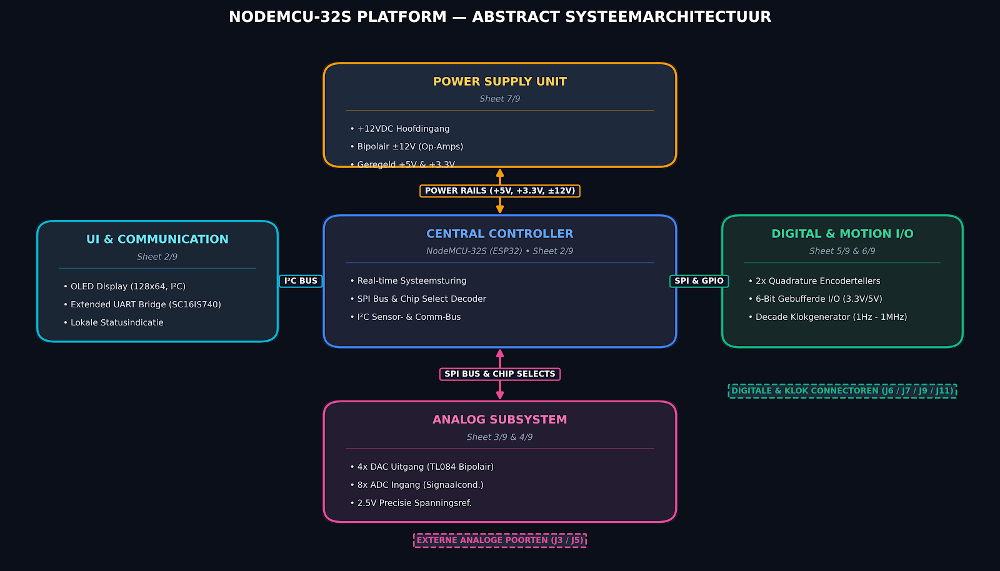
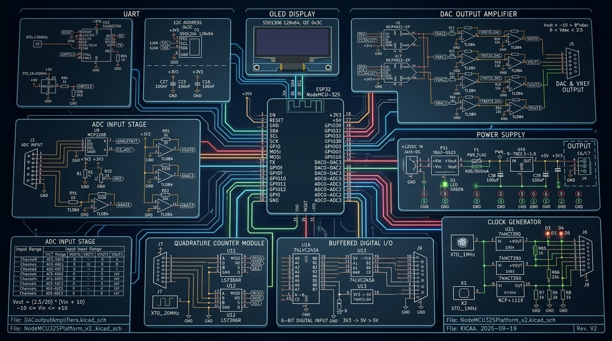

## Systeem overzicht NodeMCU

In deze module wordt het NodeMCU hostmodule en zijn perifere componenten beschreven.
De basis van de NodeMCU is een ESP-32 microcontroller.

## Kenmerken van de ESP32

*Figuur 1. ESP32*

- Microcontroller: Xtensa LX6 dual-core
- Operating voltage: 3.3 V
- Input voltage (recommended): 5 V
- Input voltage (limits): 4.5-5.5 V
- Digital I/O pins: 34 (waarvan 15 als PWM-uitgang)
- Analog input pins: 18
- Flash memory: 4 MB
- SRAM: 520 KB
- EEPROM: 0 KB
- Clock speed: 240 MHz

## Blokschema NodeMCU

[schematics](../pdfs/node_mcu_schematics.pdf)

**Subsystem Overview**

* **Microcontroller Core (Sheet 2/9):** NodeMCU-32S host module driving peripherals via SPI, I2C, and parallel GPIOs. Includes an SSD1306 OLED display, an SC16IS740 I2C-to-UART bridge, and a 74HC138 3-to-8 decoder directing SPI chip-select signals (`CS_DAC01`, `CS_DAC23`, `CS_ADC`, `CS_QC0`, `CS_QC1`).

* **DAC Output Amplifiers (Sheet 3/9):** Dual MCP4922 dual-channel 12-bit SPI DACs (4 channels total) conditioned with TL084 op-amp level shifters to provide an expanded bipolar output range, referenced to an onboard MCP1525 2.5V precision reference.

* **ADC Input Amplifiers (Sheet 4/9):** 8-channel MCP3208 SPI ADC receiving signals from 4 external level-shifted analog inputs via J3, 2 onboard calibration potentiometers, and 2 analog pushbuttons.

* **Quadrature Counters (Sheet 5/9):** Dual LS7366R dedicated quadrature encoder counter ICs clocked by an external 20 MHz oscillator, interfaced through a 74LVC245A voltage-level translator to the J7 encoder header.

* **Digital I/O (Sheet 5/9):** Buffered parallel interfaces comprising a 6-bit 5V-to-3.3V input port (74LVC245A on J11) and a 6-bit 3.3V-to-5V output driver (74HCTC245 on J9) equipped with indicator LEDs.

* **Clock Generator (Sheet 6/9):** Independent timing subsystem using a 1 MHz oscillator cascaded through 74HCT390 dual decade ripple dividers to produce decade division frequencies down to 1 Hz on connector J6.

* **Power Supply (Sheet 7/9):** Main +12VDC input feeding a buck regulator (R-78E5.0-1.0) for the primary +5V rail, an LDO (NCP1117LPST33) for +3.3V, and a TBA2-0523 isolated DC/DC module driving L78L12 / L79L12 regulators to generate clean $\pm$12V rails for analog op-amps.