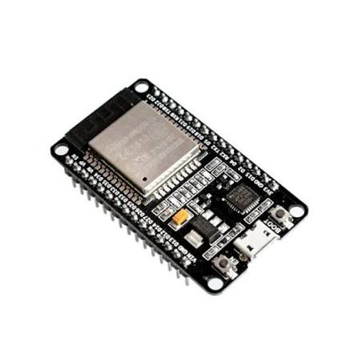

# ESP32

In deze workshop werken we met de ESP32. De ESP32 is een microcontrollerboard op basis van de Xtensa LX6 dual-core processor. Het is een populair en veelzijdig board, geschikt voor zowel beginners als gevorderden.

*Figuur 1. ESP32*

## Kenmerken van de ESP32

- Microcontroller: Xtensa LX6 dual-core
- Operating voltage: 3.3 V
- Input voltage (recommended): 5 V
- Input voltage (limits): 4.5-5.5 V
- Digital I/O pins: 34 (waarvan 15 als PWM-uitgang)
- Analog input pins: 18
- Flash memory: 4 MB
- SRAM: 520 KB
- EEPROM: 0 KB
- Clock speed: 240 MHz
