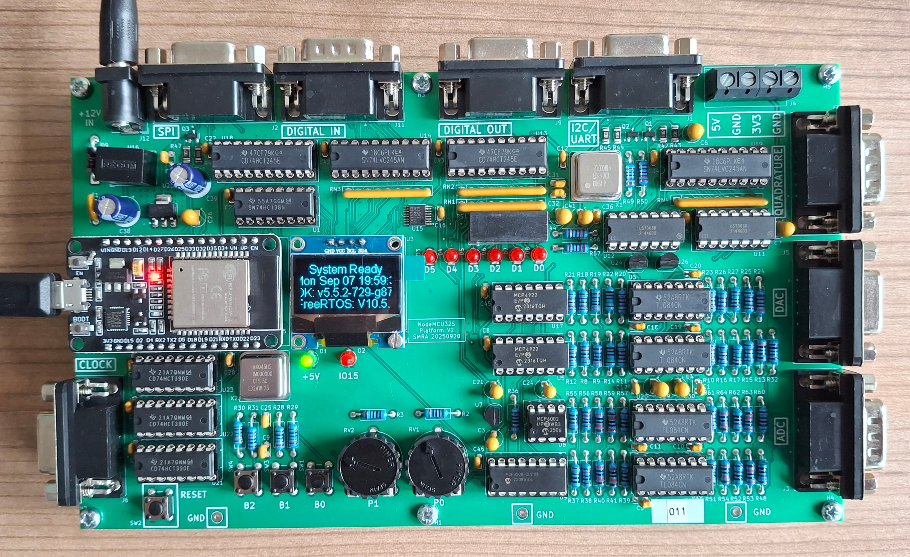

# Inleiding

Welkom bij de workshop Realtime Software Engineering.

In deze workshop leer je hoe je realtime systemen ontwerpt en implementeert. Als basis wordt gebruikgemaakt van [FreeRTOS](https://www.freertos.org/), een realtime besturingssysteem voor microcontrollers. Je werkt met praktische opdrachten waarin je stap voor stap kennis opbouwt over:

- basisprincipes van realtime software;
- programmeren voor microcontrollers;
- in- en output op microcontrollers;
- bitbewerkingen en logica;
- testen en simuleren van embedded software.


Bij de workshop wordt gebruikgemaakt van het NodeMCU-Shield, zoals weergegeven in de onderstaande afbeelding.

*Figuur 1. NodeMCU-Shield*

:::{attention}
In de workshop wordt geprogrammeerd in de taal C, echter alle bibliotheek functies zijn geschreven in C++. Je kunt alle member-functies van een object aanroepen zoals je dat in C zou doen, echter de functie wordt voorafgegaan met een verwijzing naar het object gevolgd door een ``.``(directe toegang) of een ``->``(bij pointers) operator. Hier is een voorbeeld:

*Voorbeeld van directe toegang tot member-functies van een object in C++*
```cpp
dio_device dio;

dio.SetBit(0);  // Zet de LED aan op basis van het ledNumber
dio.ClearBit(0);  // Zet de LED uit op basis van het ledNumber
```

*Voorbeeld van toegang tot member-functies van een object via een pointer in C++*

```cpp
dio_device *dio;
dio = new dio_device();

dio->SetBit(0);  // Zet de LED aan op basis van het ledNumber
dio->ClearBit(0);  // Zet de LED uit op basis van het ledNumber
```

:::